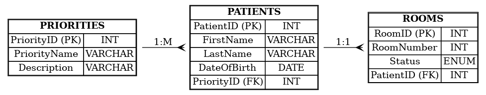

# Hospital Triage Database Design

## 1. Entities Description

### Patients
- Stores patient details such as personal information and medical conditions.
- **Attributes**:
  - `PatientID` (INT, PRIMARY KEY, AUTO_INCREMENT): Unique identifier for each patient.
  - `FirstName` (VARCHAR(50), NOT NULL): Patient's first name.
  - `LastName` (VARCHAR(50), NOT NULL): Patient's last name.
  - `DOB` (DATE, NOT NULL): Date of birth.
  - `PhoneNumber` (VARCHAR(15), NULL): Contact number.
  - `Email` (VARCHAR(100), NULL): Email address.
  - `PriorityLevel` (ENUM('Low', 'Medium', 'High'), NOT NULL): Triage priority level.
  - `ArrivalTime` (DATETIME, NOT NULL): Time of arrival at the hospital.

### Priorities
- Represents priority levels for patient triage.
- **Attributes**:
  - `PriorityID` (INT, PRIMARY KEY, AUTO_INCREMENT): Unique identifier for each priority.
  - `PriorityLevel` (ENUM('Low', 'Medium', 'High'), NOT NULL): Severity of the case.
  - `Description` (TEXT, NULL): Detailed description of the priority level.

### Rooms
- Manages room assignments for patients.
- **Attributes**:
  - `RoomID` (INT, PRIMARY KEY, AUTO_INCREMENT): Unique identifier for each room.
  - `RoomNumber` (VARCHAR(10), NOT NULL): Number of the room.
  - `RoomType` (VARCHAR(50), NOT NULL): Type of room (e.g., ICU, General Ward).
  - `PatientID` (INT, FOREIGN KEY): Reference to the assigned patient.

## 2. Relationships
- A **Patient** can have one **PriorityLevel**.
- A **Room** can have one assigned **Patient** or remain unoccupied.

## 3. Database Schema Diagram

